### DogBot<br/>
Making a bot do the most fun thing you can do in Discord, post various dog pics.<br/>

Examples of Dogs from command !Dog:<br/>
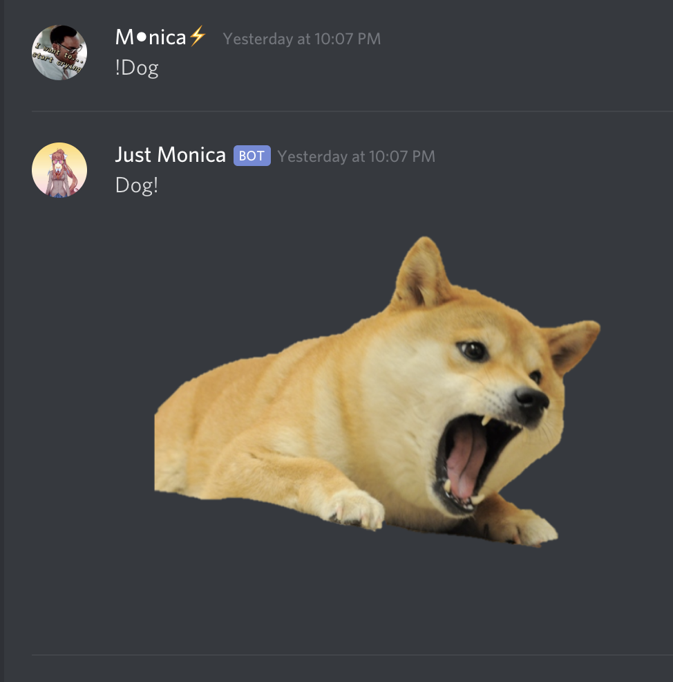
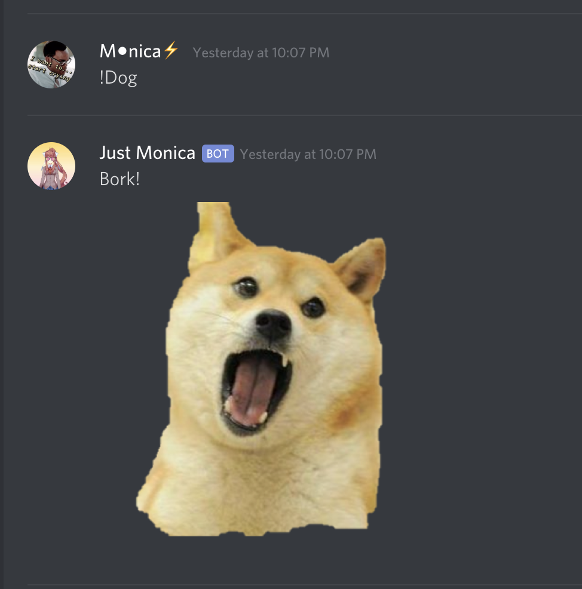
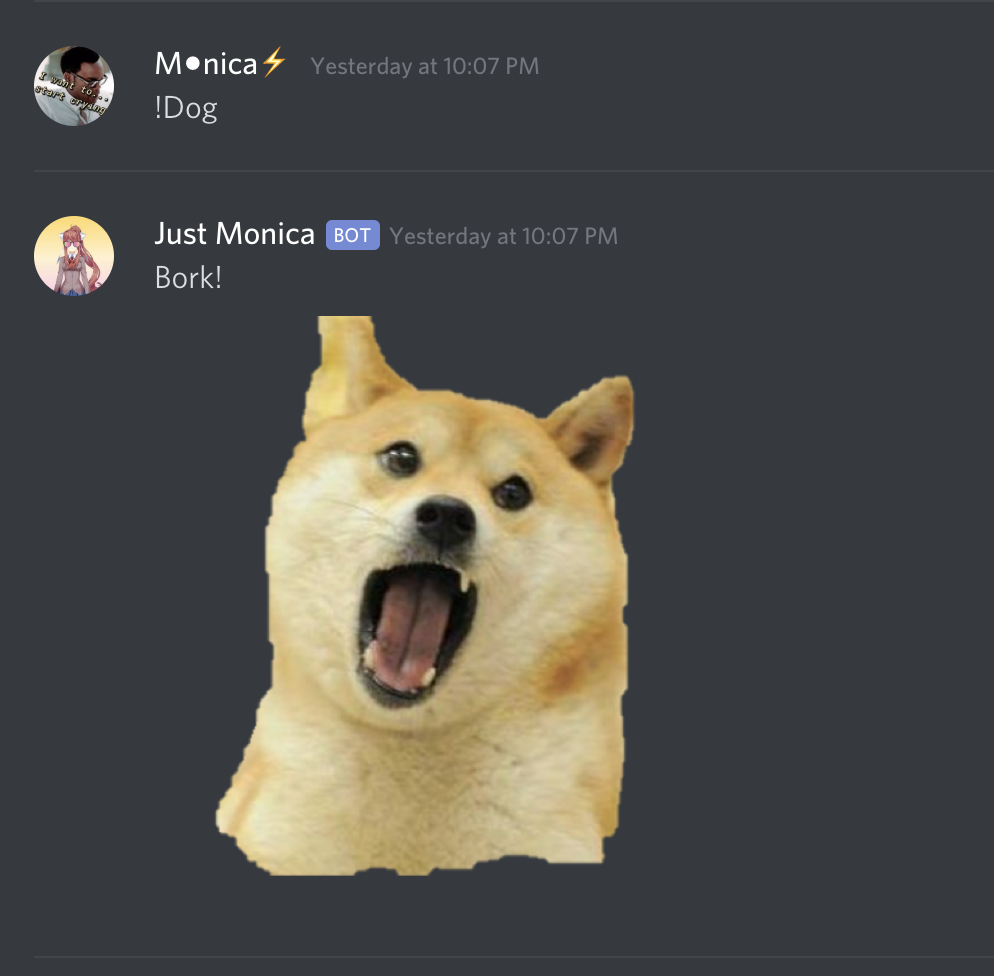<br/>

If you type 
```sh
!Dog Secret
``` 
you will get a hint for a command to get a specific dog pic<br/>
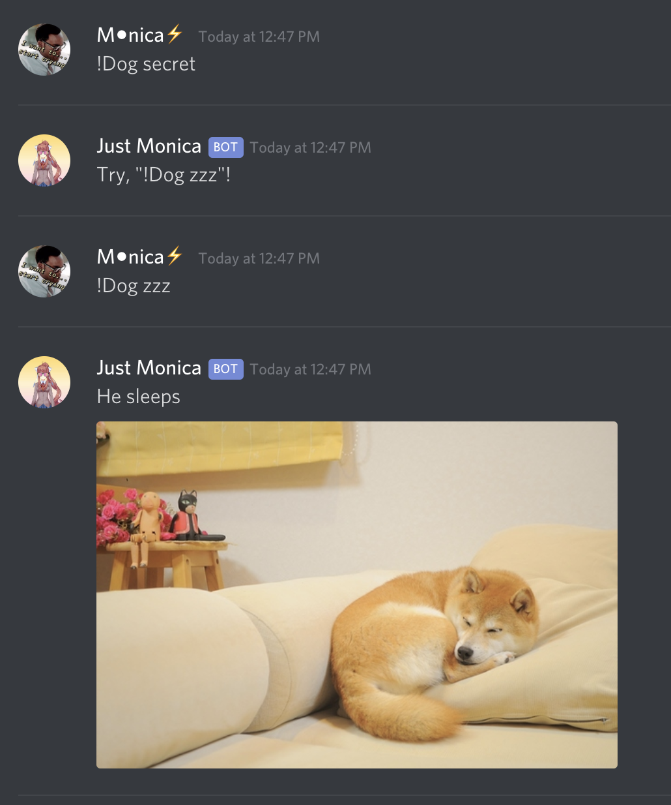

____________________________________________________________________________________
All possible Dog images:<br/>
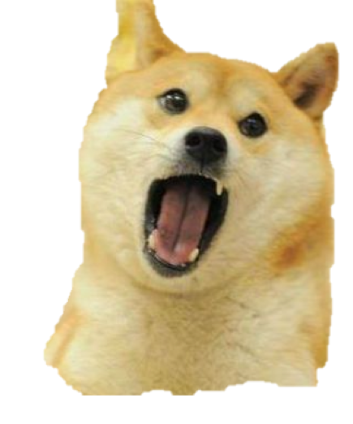

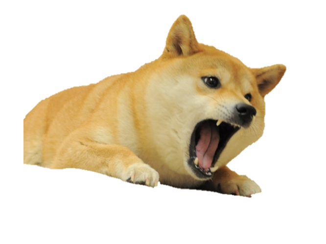
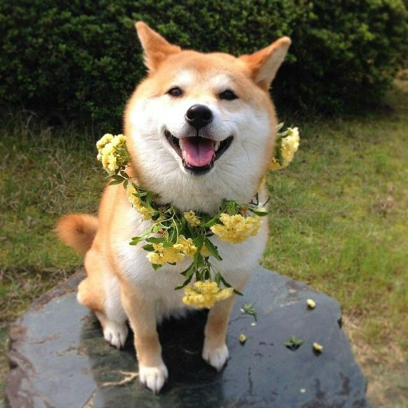
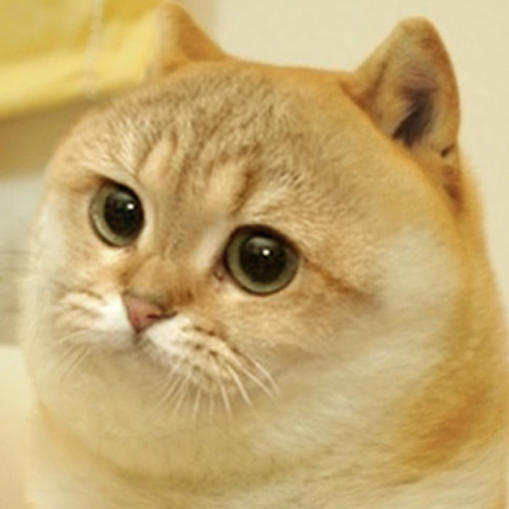
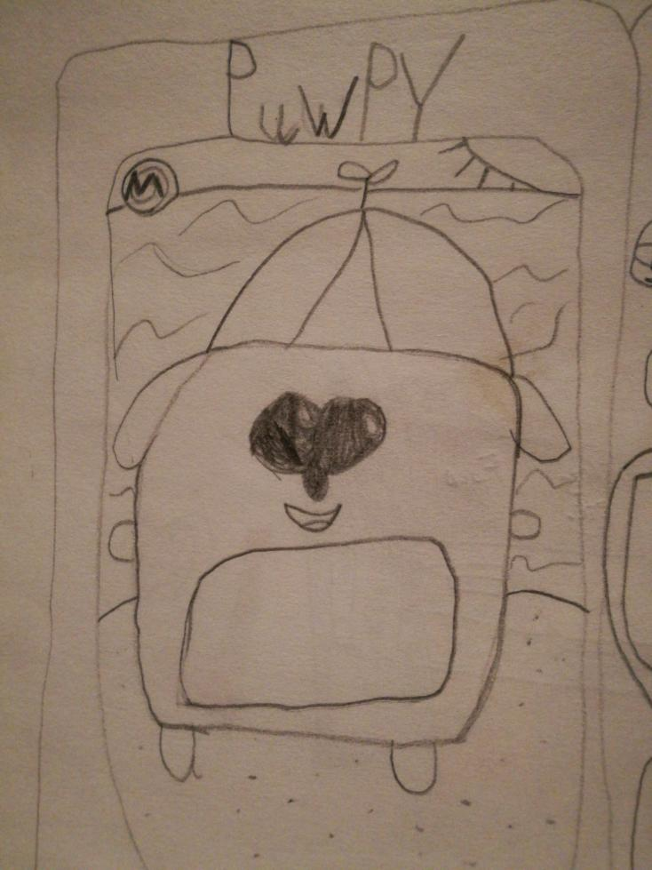
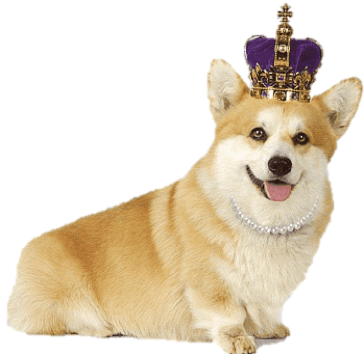
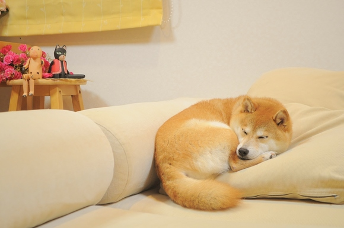

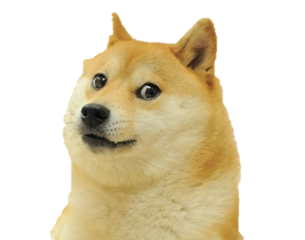
<br/>
____________________________________________________________________________________
Last Update: Dec 20, 2019

