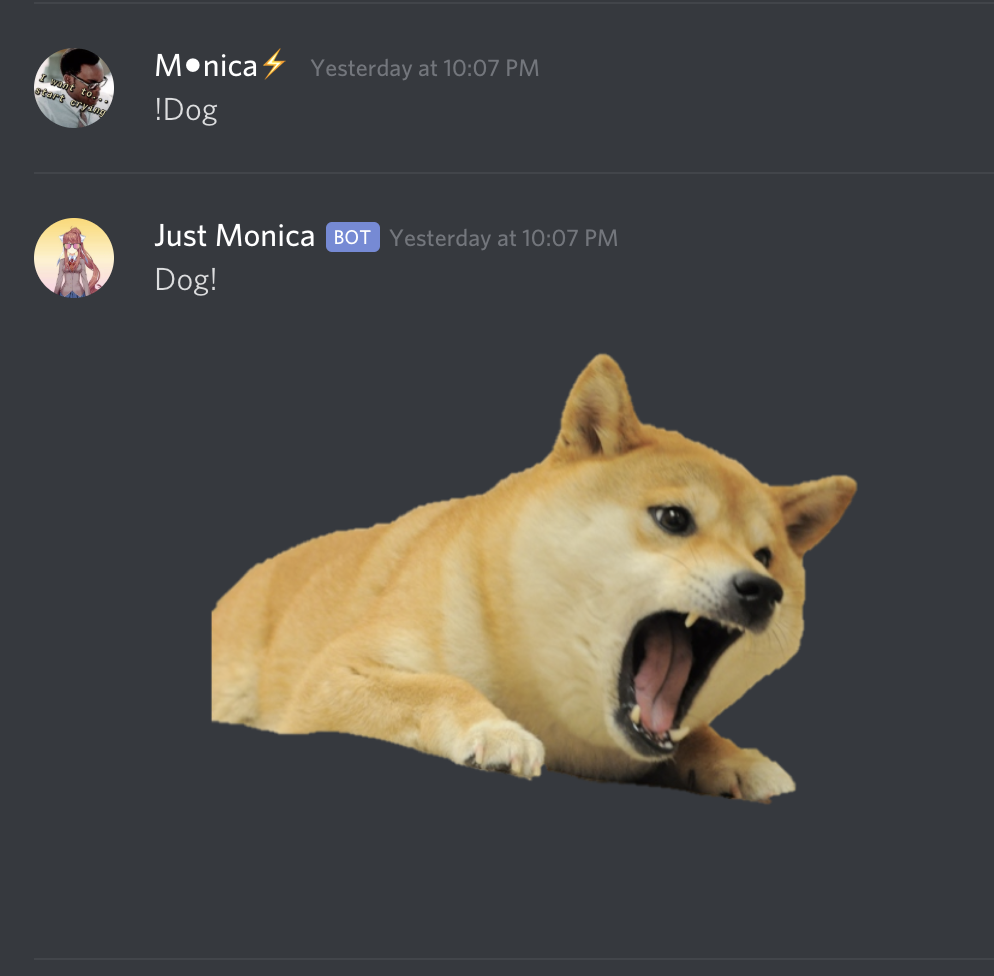
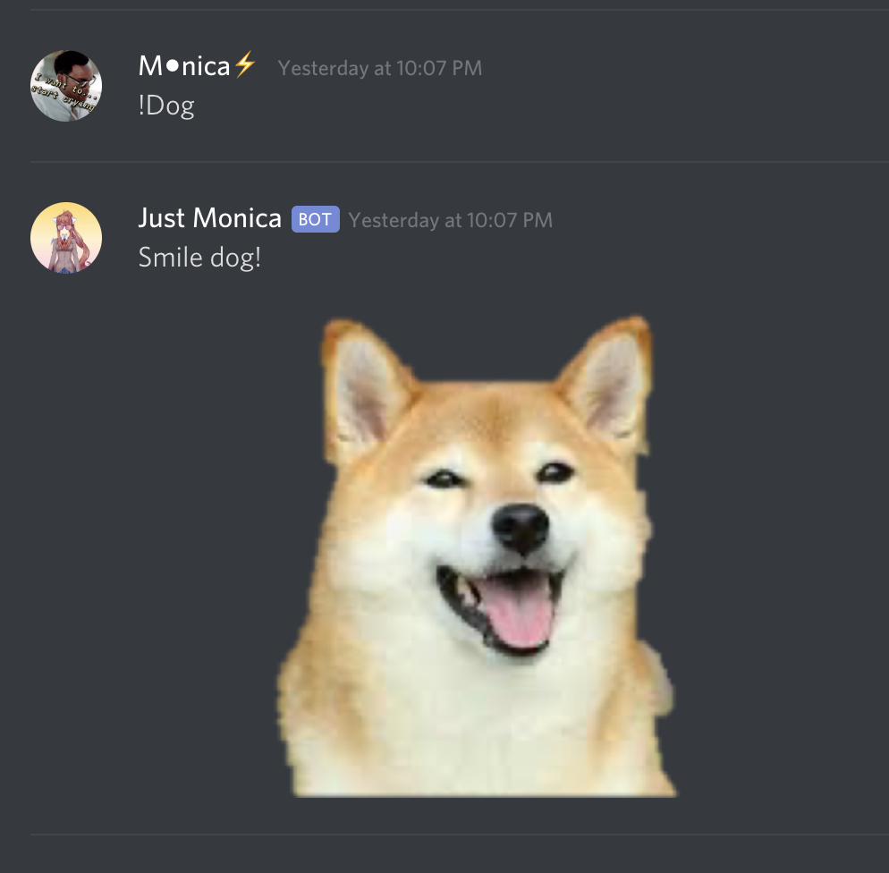
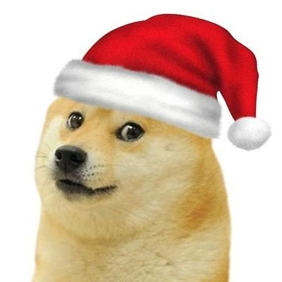

### Dog Bot<br/>
Making a bot to do fun things in Discord, post various dog pics.
Examples of Dogs from output !Dog:<br/>


<br/>

If you type 
```sh
!Dog Secret
``` 
you will get a hint for a command to get a specific dog pic<br/>


____________________________________________________________________________________
All possible Dog images:<br/>




<!---
OWO Bot<br/>
 #By Typing "whats this", alone or in a phrase, bot will return OwO:<br/>
 #<br/>
 #By Typing "OWO", bot will return one of three things:
 #- UwU<br/>
 #- owo<br/>
#- What's this?<br/>

 #<br/>
-->